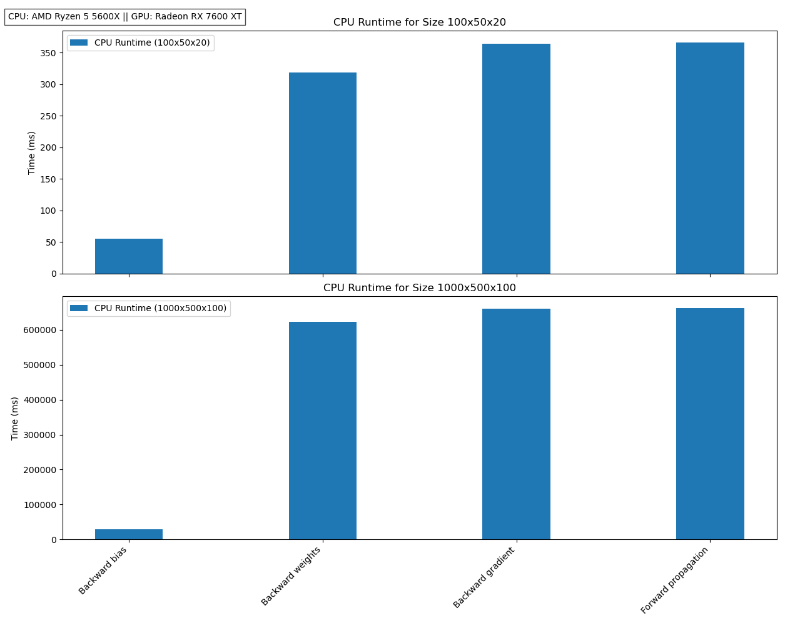
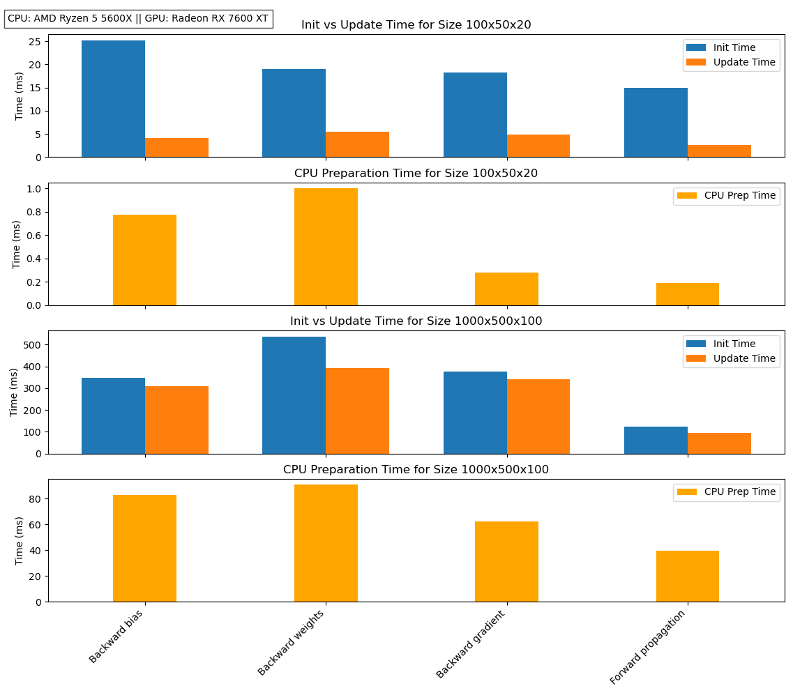

# Benchmark Results – `flashlight_tensor`

This benchmark compares CPU and GPU runtimes for core neural network operations using the `flashlight_tensor` library. Tests were conducted on different operation types with varying iterations, sample sizes, and neuron counts.

All GPU times include data upload to `gpu_data` and fused operations executed via the `gpu_runner`.
    

> ⚠️ All GPU measurements include buffer preparation overheads. In practical use (without cloning or benchmarking instrumentation), actual GPU runtimes are **likely even faster**.

> These numbers show that even in early development, `flashlight_tensor` achieves massive speedups over CPU computation — ranging from **15× to over 3500×** depending on the operation and scale.
